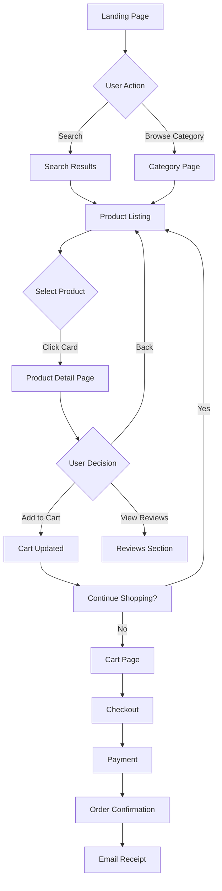

# UX Design

> **Purpose**: Production-ready UX design standards for wireframes, HTML prototypes, user flows, and accessibility.  
> **Audience**: UX designers creating user interfaces, interaction patterns, and prototypes.  
> **Standard**: Follows industry best practices from Material Design, Nielsen Norman Group, and W3C accessibility guidelines.

---

## Quick Reference

| Need | Solution | Tool/Pattern |
|------|----------|--------------|
| **Low-fidelity wireframes** | Sketch layouts with annotations | Balsamiq, Figma, or ASCII art |
| **High-fidelity prototypes** | HTML/CSS with interactions | Semantic HTML5 + Tailwind CSS |
| **User flows** | Document user journeys | Mermaid diagrams or flowcharts |
| **Accessibility** | WCAG 2.1 AA compliance | Color contrast, keyboard nav, screen readers |
| **Responsive design** | Mobile-first approach | Breakpoints: 640px, 768px, 1024px, 1280px |
| **Design tokens** | Consistent spacing/colors | Tailwind config or CSS variables |

---

## Wireframing Standards

### Low-Fidelity Wireframes

**Purpose**: Rapid iteration on layout and information architecture without visual design details.

**Required Elements**:
1. **Layout structure** - Header, navigation, content areas, footer
2. **Content hierarchy** - H1, H2, body text, CTAs
3. **Placeholder content** - Lorem ipsum or representative text
4. **Annotations** - Explain interactions, states, and behaviors
5. **Navigation paths** - Show how users move between screens

**Example ASCII Wireframe**:
```
+----------------------------------------------------------+
|  LOGO                          [Search] [Login] [Cart]   |
+----------------------------------------------------------+
|  Home | Products | About | Contact                       |
+----------------------------------------------------------+
|                                                          |
|  +--------------------+     +------------------------+   |
|  |                    |     |                        |   |
|  |   Hero Image       |     |  Featured Product      |   |
|  |   (1200x600)       |     |  - Title               |   |
|  |                    |     |  - Price               |   |
|  +--------------------+     |  - [Add to Cart]       |   |
|                             +------------------------+   |
|  Product Grid                                            |
|  +--------+ +--------+ +--------+ +--------+             |
|  | Img    | | Img    | | Img    | | Img    |             |
|  | Title  | | Title  | | Title  | | Title  |             |
|  | $19.99 | | $24.99 | | $29.99 | | $34.99 |             |
|  +--------+ +--------+ +--------+ +--------+             |
|                                                          |
+----------------------------------------------------------+
|  Footer: © 2026 Company | Privacy | Terms | Social      |
+----------------------------------------------------------+

Annotations:
- Hero Image: Carousel with 3 slides, auto-advance every 5s
- Search: Opens modal with autocomplete
- Product Grid: Responsive (1 col mobile, 2 col tablet, 4 col desktop)
- Add to Cart: Shows toast notification, updates cart count
```

### Markdown Wireframe Template

```markdown
## Screen: [Name] (e.g., Product Listing Page)

### Layout
- **Header**: Logo (left), Search (center), User menu (right)
- **Navigation**: Horizontal menu with 5 categories
- **Content**: Grid of product cards (responsive)
- **Sidebar**: Filters (desktop only, drawer on mobile)
- **Footer**: Links, social media, newsletter signup

### Components
1. **Product Card**
   - Image: 300x300px placeholder
   - Title: H3, 2 lines max with ellipsis
   - Price: Bold, primary color
   - Rating: 5-star display with count
   - CTA: "Add to Cart" button

2. **Filter Panel**
   - Category checkboxes (collapsible groups)
   - Price range slider
   - Color swatches
   - [Apply Filters] button

### Interactions
- Click product card → Navigate to Product Detail Page
- Hover product card → Show quick view button
- Click filter → Update results without page reload
- Mobile: Filters in slide-out drawer

### States
- Loading: Skeleton screens for cards
- Empty: "No products found" message with clear filters button
- Error: Retry button with error message

### Responsive Behavior
- Mobile (< 640px): 1 column, filters in drawer
- Tablet (640-1024px): 2 columns, collapsible sidebar
- Desktop (> 1024px): 4 columns, persistent sidebar
```

---

## HTML Prototype Standards

### Structure

**Requirements**:
1. **Semantic HTML5** - Use proper elements (`<nav>`, `<main>`, `<article>`, etc.)
2. **Accessibility** - ARIA labels, keyboard navigation, screen reader support
3. **Responsive** - Mobile-first with Tailwind CSS breakpoints
4. **Interactive** - Clickable links, form validation, state changes
5. **Documentation** - Inline comments explaining interactions

### Example HTML Prototype Template

```html
<!DOCTYPE html>
<html lang="en">
<head>
    <meta charset="UTF-8">
    <meta name="viewport" content="width=device-width, initial-scale=1.0">
    <title>UX Prototype - Product Listing</title>
    
    <!-- Tailwind CSS CDN (replace with build version in production) -->
    <script src="https://cdn.tailwindcss.com"></script>
    
    <!-- Custom styles for prototype -->
    <style>
        /* Interaction states */
        .product-card:hover {
            transform: translateY(-4px);
            box-shadow: 0 10px 25px rgba(0, 0, 0, 0.1);
        }
        
        /* Placeholder for images */
        .placeholder-img {
            background: linear-gradient(135deg, #667eea 0%, #764ba2 100%);
        }
    </style>
</head>
<body class="bg-gray-50">
    <!-- Header -->
    <header class="bg-white shadow-sm sticky top-0 z-50">
        <div class="container mx-auto px-4 py-4">
            <div class="flex items-center justify-between">
                <!-- Logo -->
                <div class="text-2xl font-bold text-blue-600">
                    <a href="#" aria-label="Home">Logo</a>
                </div>
                
                <!-- Search (desktop) -->
                <div class="hidden md:flex flex-1 max-w-md mx-8">
                    <input 
                        type="search" 
                        placeholder="Search products..." 
                        class="w-full px-4 py-2 border border-gray-300 rounded-lg focus:ring-2 focus:ring-blue-500 focus:border-transparent"
                        aria-label="Search products"
                    />
                </div>
                
                <!-- Actions -->
                <nav class="flex items-center space-x-4">
                    <button 
                        class="md:hidden p-2 hover:bg-gray-100 rounded"
                        aria-label="Search"
                    >
                        <svg class="w-6 h-6" fill="none" stroke="currentColor" viewBox="0 0 24 24">
                            <path stroke-linecap="round" stroke-linejoin="round" stroke-width="2" d="M21 21l-6-6m2-5a7 7 0 11-14 0 7 7 0 0114 0z" />
                        </svg>
                    </button>
                    <a href="#" class="p-2 hover:bg-gray-100 rounded" aria-label="Login">
                        <svg class="w-6 h-6" fill="none" stroke="currentColor" viewBox="0 0 24 24">
                            <path stroke-linecap="round" stroke-linejoin="round" stroke-width="2" d="M16 7a4 4 0 11-8 0 4 4 0 018 0zM12 14a7 7 0 00-7 7h14a7 7 0 00-7-7z" />
                        </svg>
                    </a>
                    <a href="#" class="p-2 hover:bg-gray-100 rounded relative" aria-label="Cart">
                        <svg class="w-6 h-6" fill="none" stroke="currentColor" viewBox="0 0 24 24">
                            <path stroke-linecap="round" stroke-linejoin="round" stroke-width="2" d="M3 3h2l.4 2M7 13h10l4-8H5.4M7 13L5.4 5M7 13l-2.293 2.293c-.63.63-.184 1.707.707 1.707H17m0 0a2 2 0 100 4 2 2 0 000-4zm-8 2a2 2 0 11-4 0 2 2 0 014 0z" />
                        </svg>
                        <span class="absolute -top-1 -right-1 bg-blue-600 text-white text-xs rounded-full w-5 h-5 flex items-center justify-center">
                            3
                        </span>
                    </a>
                </nav>
            </div>
            
            <!-- Category Navigation -->
            <nav class="mt-4 hidden md:block">
                <ul class="flex space-x-6 text-sm">
                    <li><a href="#" class="text-gray-700 hover:text-blue-600 font-medium">Electronics</a></li>
                    <li><a href="#" class="text-gray-700 hover:text-blue-600">Clothing</a></li>
                    <li><a href="#" class="text-gray-700 hover:text-blue-600">Home & Garden</a></li>
                    <li><a href="#" class="text-gray-700 hover:text-blue-600">Sports</a></li>
                    <li><a href="#" class="text-gray-700 hover:text-blue-600">Books</a></li>
                </ul>
            </nav>
        </div>
    </header>
    
    <!-- Main Content -->
    <main class="container mx-auto px-4 py-8">
        <div class="lg:flex lg:space-x-8">
            <!-- Filters Sidebar (desktop) -->
            <aside class="hidden lg:block lg:w-64 flex-shrink-0">
                <div class="bg-white rounded-lg shadow p-6 sticky top-24">
                    <h2 class="text-lg font-semibold mb-4">Filters</h2>
                    
                    <!-- Category Filter -->
                    <div class="mb-6">
                        <h3 class="font-medium mb-2">Category</h3>
                        <div class="space-y-2">
                            <label class="flex items-center">
                                <input type="checkbox" class="mr-2" checked />
                                <span class="text-sm">Electronics (24)</span>
                            </label>
                            <label class="flex items-center">
                                <input type="checkbox" class="mr-2" />
                                <span class="text-sm">Accessories (12)</span>
                            </label>
                            <label class="flex items-center">
                                <input type="checkbox" class="mr-2" />
                                <span class="text-sm">Cables (8)</span>
                            </label>
                        </div>
                    </div>
                    
                    <!-- Price Range -->
                    <div class="mb-6">
                        <h3 class="font-medium mb-2">Price Range</h3>
                        <div class="flex items-center space-x-2">
                            <input type="number" placeholder="Min" class="w-20 px-2 py-1 border rounded text-sm" />
                            <span>-</span>
                            <input type="number" placeholder="Max" class="w-20 px-2 py-1 border rounded text-sm" />
                        </div>
                    </div>
                    
                    <!-- Color Filter -->
                    <div class="mb-6">
                        <h3 class="font-medium mb-2">Color</h3>
                        <div class="flex space-x-2">
                            <button class="w-8 h-8 rounded-full bg-black border-2 border-gray-300" aria-label="Black"></button>
                            <button class="w-8 h-8 rounded-full bg-white border-2 border-gray-300" aria-label="White"></button>
                            <button class="w-8 h-8 rounded-full bg-blue-500 border-2 border-gray-300" aria-label="Blue"></button>
                            <button class="w-8 h-8 rounded-full bg-red-500 border-2 border-gray-300" aria-label="Red"></button>
                        </div>
                    </div>
                    
                    <button class="w-full bg-blue-600 text-white py-2 rounded-lg hover:bg-blue-700 transition">
                        Apply Filters
                    </button>
                </div>
            </aside>
            
            <!-- Product Grid -->
            <div class="flex-1">
                <!-- Results Header -->
                <div class="flex items-center justify-between mb-6">
                    <p class="text-gray-600">Showing 24 results</p>
                    <div class="flex items-center space-x-4">
                        <button class="lg:hidden text-blue-600 font-medium">
                            Filters
                        </button>
                        <select class="border border-gray-300 rounded-lg px-3 py-2 text-sm">
                            <option>Sort by: Featured</option>
                            <option>Price: Low to High</option>
                            <option>Price: High to Low</option>
                            <option>Newest</option>
                            <option>Best Rating</option>
                        </select>
                    </div>
                </div>
                
                <!-- Product Cards Grid -->
                <div class="grid grid-cols-1 sm:grid-cols-2 lg:grid-cols-3 xl:grid-cols-4 gap-6">
                    <!-- Product Card 1 -->
                    <article class="product-card bg-white rounded-lg shadow overflow-hidden transition-all duration-300 cursor-pointer">
                        <a href="#" class="block">
                            <!-- Product Image -->
                            <div class="placeholder-img aspect-square flex items-center justify-center text-white text-sm">
                                Product Image
                            </div>
                            
                            <!-- Product Info -->
                            <div class="p-4">
                                <h3 class="font-semibold text-gray-800 mb-1 line-clamp-2">
                                    Wireless Bluetooth Headphones with Noise Cancellation
                                </h3>
                                
                                <!-- Rating -->
                                <div class="flex items-center mb-2">
                                    <div class="flex text-yellow-400">
                                        <svg class="w-4 h-4 fill-current" viewBox="0 0 20 20">
                                            <path d="M10 15l-5.878 3.09 1.123-6.545L.489 6.91l6.572-.955L10 0l2.939 5.955 6.572.955-4.756 4.635 1.123 6.545z"/>
                                        </svg>
                                        <svg class="w-4 h-4 fill-current" viewBox="0 0 20 20">
                                            <path d="M10 15l-5.878 3.09 1.123-6.545L.489 6.91l6.572-.955L10 0l2.939 5.955 6.572.955-4.756 4.635 1.123 6.545z"/>
                                        </svg>
                                        <svg class="w-4 h-4 fill-current" viewBox="0 0 20 20">
                                            <path d="M10 15l-5.878 3.09 1.123-6.545L.489 6.91l6.572-.955L10 0l2.939 5.955 6.572.955-4.756 4.635 1.123 6.545z"/>
                                        </svg>
                                        <svg class="w-4 h-4 fill-current" viewBox="0 0 20 20">
                                            <path d="M10 15l-5.878 3.09 1.123-6.545L.489 6.91l6.572-.955L10 0l2.939 5.955 6.572.955-4.756 4.635 1.123 6.545z"/>
                                        </svg>
                                        <svg class="w-4 h-4 fill-current text-gray-300" viewBox="0 0 20 20">
                                            <path d="M10 15l-5.878 3.09 1.123-6.545L.489 6.91l6.572-.955L10 0l2.939 5.955 6.572.955-4.756 4.635 1.123 6.545z"/>
                                        </svg>
                                    </div>
                                    <span class="text-sm text-gray-600 ml-2">(128)</span>
                                </div>
                                
                                <!-- Price -->
                                <div class="flex items-center justify-between">
                                    <span class="text-xl font-bold text-gray-900">$89.99</span>
                                    <span class="text-sm text-gray-500 line-through">$129.99</span>
                                </div>
                            </div>
                        </a>
                        
                        <!-- Add to Cart Button -->
                        <div class="px-4 pb-4">
                            <button class="w-full bg-blue-600 text-white py-2 rounded-lg hover:bg-blue-700 transition">
                                Add to Cart
                            </button>
                        </div>
                    </article>
                    
                    <!-- Repeat product cards (abbreviated for example) -->
                    <!-- Product Card 2-8 would follow the same pattern -->
                    
                </div>
                
                <!-- Pagination -->
                <div class="mt-8 flex justify-center">
                    <nav class="flex items-center space-x-2" aria-label="Pagination">
                        <button class="px-3 py-2 rounded border border-gray-300 hover:bg-gray-50" aria-label="Previous page">
                            Previous
                        </button>
                        <button class="px-3 py-2 rounded bg-blue-600 text-white">1</button>
                        <button class="px-3 py-2 rounded border border-gray-300 hover:bg-gray-50">2</button>
                        <button class="px-3 py-2 rounded border border-gray-300 hover:bg-gray-50">3</button>
                        <button class="px-3 py-2 rounded border border-gray-300 hover:bg-gray-50" aria-label="Next page">
                            Next
                        </button>
                    </nav>
                </div>
            </div>
        </div>
    </main>
    
    <!-- Footer -->
    <footer class="bg-gray-900 text-gray-300 mt-16">
        <div class="container mx-auto px-4 py-8">
            <div class="grid grid-cols-1 md:grid-cols-4 gap-8">
                <div>
                    <h3 class="text-white font-semibold mb-4">Company</h3>
                    <ul class="space-y-2 text-sm">
                        <li><a href="#" class="hover:text-white">About Us</a></li>
                        <li><a href="#" class="hover:text-white">Careers</a></li>
                        <li><a href="#" class="hover:text-white">Press</a></li>
                    </ul>
                </div>
                <div>
                    <h3 class="text-white font-semibold mb-4">Support</h3>
                    <ul class="space-y-2 text-sm">
                        <li><a href="#" class="hover:text-white">Help Center</a></li>
                        <li><a href="#" class="hover:text-white">Contact Us</a></li>
                        <li><a href="#" class="hover:text-white">Returns</a></li>
                    </ul>
                </div>
                <div>
                    <h3 class="text-white font-semibold mb-4">Legal</h3>
                    <ul class="space-y-2 text-sm">
                        <li><a href="#" class="hover:text-white">Privacy Policy</a></li>
                        <li><a href="#" class="hover:text-white">Terms of Service</a></li>
                        <li><a href="#" class="hover:text-white">Cookie Policy</a></li>
                    </ul>
                </div>
                <div>
                    <h3 class="text-white font-semibold mb-4">Newsletter</h3>
                    <p class="text-sm mb-4">Get the latest updates and offers.</p>
                    <form class="flex">
                        <input 
                            type="email" 
                            placeholder="Your email" 
                            class="flex-1 px-4 py-2 rounded-l bg-gray-800 text-white"
                            aria-label="Email address"
                        />
                        <button class="bg-blue-600 px-4 py-2 rounded-r hover:bg-blue-700">
                            Subscribe
                        </button>
                    </form>
                </div>
            </div>
            <div class="border-t border-gray-800 mt-8 pt-8 text-sm text-center">
                © 2026 Company Name. All rights reserved.
            </div>
        </div>
    </footer>
    
    <!-- Prototype JavaScript (Optional interactions) -->
    <script>
        // Add to Cart interaction
        document.querySelectorAll('.product-card button').forEach(button => {
            button.addEventListener('click', (e) => {
                e.preventDefault();
                e.stopPropagation();
                
                // Show toast notification (simulate)
                alert('[PROTOTYPE] Product added to cart');
                
                // Update cart count
                const cartBadge = document.querySelector('.relative span');
                cartBadge.textContent = parseInt(cartBadge.textContent) + 1;
            });
        });
        
        // Filter interaction
        document.querySelector('aside button').addEventListener('click', () => {
            alert('[PROTOTYPE] Filters applied - page would reload with filtered results');
        });
    </script>
</body>
</html>
```

---

## User Flow Documentation

### Mermaid Diagram Format

```markdown
## User Flow: Product Purchase



### Decision Points
- **Search vs Browse**: Users can search (faster) or browse categories (discovery)
- **Product Detail**: Users review product info, images, reviews before adding
- **Cart**: Users can continue shopping or proceed to checkout
- **Checkout**: Multi-step process with validation at each stage
```

### Text-Based Flow

```
1. Entry Points
   └─> Homepage
       ├─> Search bar (Quick path)
       └─> Category navigation (Browse path)

2. Product Discovery
   └─> Product Listing Page
       ├─> Filters (Narrow results)
       ├─> Sort options (Order results)
       └─> Product cards (Preview)

3. Product Evaluation
   └─> Product Detail Page
       ├─> Image gallery (Visual inspection)
       ├─> Specifications (Technical details)
       ├─> Reviews & ratings (Social proof)
       └─> Related products (Alternatives)

4. Purchase Decision
   └─> Add to Cart
       ├─> Continue shopping (Back to step 2)
       └─> Proceed to checkout

5. Checkout Process
   └─> Cart Review
       ├─> Update quantities
       ├─> Apply coupon
       └─> Shipping information
           └─> Payment method
               └─> Order confirmation

6. Post-Purchase
   └─> Confirmation page
       ├─> Email receipt
       ├─> Track order link
       └─> Account creation (optional)
```

---

## Accessibility Standards (WCAG 2.1 AA)

### Required Compliance

| Criterion | Requirement | Implementation |
|-----------|-------------|----------------|
| **Color Contrast** | 4.5:1 for normal text, 3:1 for large text | Use contrast checker tools |
| **Keyboard Navigation** | All interactive elements accessible | `tabindex`, focus states |
| **Screen Readers** | ARIA labels for all controls | `aria-label`, `aria-labelledby` |
| **Alt Text** | Descriptive text for images | `alt="Product: Wireless Headphones"` |
| **Form Labels** | Every input has a label | `<label for="email">` |
| **Focus Indicators** | Visible focus state | `:focus` styles |
| **Semantic HTML** | Proper element usage | `<nav>`, `<main>`, `<button>` |

### Checklist

```markdown
## Accessibility Checklist

### Visual
- [ ] Color contrast ratio ≥ 4.5:1 (normal text)
- [ ] Color contrast ratio ≥ 3:1 (large text, icons)
- [ ] Text resizable up to 200% without breaking layout
- [ ] No information conveyed by color alone

### Keyboard
- [ ] All interactive elements reachable via Tab key
- [ ] Focus order follows logical reading order
- [ ] Visible focus indicators on all focusable elements
- [ ] No keyboard traps (can escape modals, dropdowns)
- [ ] Skip to main content link present

### Screen Readers
- [ ] All images have alt text (decorative images: alt="")
- [ ] ARIA labels on icon-only buttons
- [ ] Form inputs have associated labels
- [ ] Error messages announced to screen readers
- [ ] Page title describes page purpose

### Forms
- [ ] Required fields indicated (not just by color)
- [ ] Error messages clear and actionable
- [ ] Input validation provides helpful feedback
- [ ] Autocomplete attributes for common fields

### Content
- [ ] Headings in logical order (H1, H2, H3)
- [ ] Link text descriptive (not "click here")
- [ ] Language of page declared (lang="en")
- [ ] No auto-playing audio/video
```

---

## Responsive Design Patterns

### Breakpoints (Tailwind CSS)

| Breakpoint | Width | Device | Pattern |
|------------|-------|--------|---------|
| `sm` | 640px | Mobile landscape | 2 columns |
| `md` | 768px | Tablet portrait | 3 columns, show sidebar |
| `lg` | 1024px | Tablet landscape | 4 columns, persistent sidebar |
| `xl` | 1280px | Desktop | Max container width |
| `2xl` | 1536px | Large desktop | Same as xl with more spacing |

### Mobile-First Approach

```html
<!-- Base styles are mobile, add complexity at larger breakpoints -->
<div class="
    grid grid-cols-1     <!-- Mobile: 1 column -->
    sm:grid-cols-2       <!-- Small: 2 columns -->
    lg:grid-cols-4       <!-- Large: 4 columns -->
    gap-4                <!-- Mobile gap -->
    md:gap-6             <!-- Medium+ gap -->
    p-4                  <!-- Mobile padding -->
    md:p-6               <!-- Medium+ padding -->
    lg:p-8               <!-- Large+ padding -->
">
    <!-- Content -->
</div>
```

### Common Patterns

**Navigation**:
- Mobile: Hamburger menu → Slide-out drawer
- Tablet: Collapsible menu bar
- Desktop: Full horizontal menu

**Sidebar**:
- Mobile: Bottom sheet or separate page
- Tablet: Collapsible panel
- Desktop: Persistent sidebar

**Product Grid**:
- Mobile: 1 column (full width cards)
- Tablet: 2-3 columns
- Desktop: 4+ columns

---

## Design Tokens

### Color System

```css
/* Primary Colors */
--color-primary-50: #eff6ff;
--color-primary-100: #dbeafe;
--color-primary-500: #3b82f6;  /* Main brand color */
--color-primary-600: #2563eb;  /* Hover state */
--color-primary-900: #1e3a8a;

/* Semantic Colors */
--color-success: #10b981;
--color-warning: #f59e0b;
--color-error: #ef4444;
--color-info: #3b82f6;

/* Neutral Scale */
--color-gray-50: #f9fafb;
--color-gray-100: #f3f4f6;
--color-gray-500: #6b7280;  /* Body text */
--color-gray-900: #111827;  /* Headings */
```

### Spacing Scale

```css
/* Tailwind default scale (consistent spacing) */
--space-1: 0.25rem;   /* 4px */
--space-2: 0.5rem;    /* 8px */
--space-4: 1rem;      /* 16px */
--space-6: 1.5rem;    /* 24px */
--space-8: 2rem;      /* 32px */
--space-12: 3rem;     /* 48px */
--space-16: 4rem;     /* 64px */
```

### Typography

```css
/* Font Sizes */
--text-xs: 0.75rem;    /* 12px */
--text-sm: 0.875rem;   /* 14px */
--text-base: 1rem;     /* 16px - Body */
--text-lg: 1.125rem;   /* 18px */
--text-xl: 1.25rem;    /* 20px */
--text-2xl: 1.5rem;    /* 24px - H3 */
--text-3xl: 1.875rem;  /* 30px - H2 */
--text-4xl: 2.25rem;   /* 36px - H1 */

/* Font Weights */
--font-normal: 400;
--font-medium: 500;
--font-semibold: 600;
--font-bold: 700;

/* Line Heights */
--leading-tight: 1.25;   /* Headings */
--leading-normal: 1.5;   /* Body text */
--leading-relaxed: 1.75; /* Long-form content */
```

---

## Component Library

### Button Variants

```html
<!-- Primary Button -->
<button class="px-6 py-3 bg-blue-600 text-white rounded-lg hover:bg-blue-700 focus:ring-2 focus:ring-blue-500 focus:ring-offset-2 transition">
    Primary Action
</button>

<!-- Secondary Button -->
<button class="px-6 py-3 border-2 border-blue-600 text-blue-600 rounded-lg hover:bg-blue-50 focus:ring-2 focus:ring-blue-500 transition">
    Secondary Action
</button>

<!-- Danger Button -->
<button class="px-6 py-3 bg-red-600 text-white rounded-lg hover:bg-red-700 focus:ring-2 focus:ring-red-500 transition">
    Delete
</button>

<!-- Icon Button -->
<button class="p-3 hover:bg-gray-100 rounded-full transition" aria-label="Close">
    <svg class="w-6 h-6" fill="none" stroke="currentColor" viewBox="0 0 24 24">
        <path stroke-linecap="round" stroke-linejoin="round" stroke-width="2" d="M6 18L18 6M6 6l12 12" />
    </svg>
</button>
```

### Form Elements

```html
<!-- Text Input -->
<div class="mb-4">
    <label for="email" class="block text-sm font-medium text-gray-700 mb-2">
        Email Address *
    </label>
    <input 
        type="email" 
        id="email" 
        name="email"
        required
        class="w-full px-4 py-2 border border-gray-300 rounded-lg focus:ring-2 focus:ring-blue-500 focus:border-transparent"
        placeholder="you@example.com"
    />
    <p class="mt-1 text-sm text-gray-500">We'll never share your email.</p>
</div>

<!-- Select Dropdown -->
<div class="mb-4">
    <label for="country" class="block text-sm font-medium text-gray-700 mb-2">
        Country
    </label>
    <select 
        id="country" 
        name="country"
        class="w-full px-4 py-2 border border-gray-300 rounded-lg focus:ring-2 focus:ring-blue-500"
    >
        <option>Select a country</option>
        <option value="us">United States</option>
        <option value="uk">United Kingdom</option>
        <option value="ca">Canada</option>
    </select>
</div>

<!-- Checkbox -->
<label class="flex items-start">
    <input type="checkbox" class="mt-1 mr-3" required />
    <span class="text-sm text-gray-700">
        I agree to the <a href="#" class="text-blue-600 hover:underline">Terms and Conditions</a>
    </span>
</label>

<!-- Radio Buttons -->
<fieldset>
    <legend class="block text-sm font-medium text-gray-700 mb-2">
        Shipping Method
    </legend>
    <label class="flex items-center mb-2">
        <input type="radio" name="shipping" value="standard" class="mr-2" checked />
        <span class="text-sm">Standard (5-7 days) - Free</span>
    </label>
    <label class="flex items-center">
        <input type="radio" name="shipping" value="express" class="mr-2" />
        <span class="text-sm">Express (2-3 days) - $9.99</span>
    </label>
</fieldset>
```

### Card Component

```html
<article class="bg-white rounded-lg shadow-md overflow-hidden hover:shadow-lg transition">
    <!-- Card Image -->
    
    
    <!-- Card Body -->
    <div class="p-6">
        <h3 class="text-xl font-semibold mb-2">Card Title</h3>
        <p class="text-gray-600 mb-4">
            Brief description of the card content goes here.
        </p>
        <a href="#" class="text-blue-600 hover:underline font-medium">
            Learn More →
        </a>
    </div>
    
    <!-- Card Footer (optional) -->
    <div class="px-6 py-4 bg-gray-50 border-t">
        <div class="flex items-center justify-between text-sm text-gray-600">
            <span>Posted 2 days ago</span>
            <span>5 min read</span>
        </div>
    </div>
</article>
```

---

## Deliverables Checklist

### UX Designer Handoff Package

```markdown
## Handoff Checklist

### Documentation
- [ ] Wireframes (low-fidelity or high-fidelity)
- [ ] User flow diagrams (Mermaid or flowchart)
- [ ] HTML prototype with interactions
- [ ] Component specifications
- [ ] Responsive behavior notes
- [ ] Accessibility annotations

### Assets
- [ ] HTML prototype files (.html, .css, .js)
- [ ] Wireframe images (PNG/PDF)
- [ ] Flow diagrams (Mermaid code or images)
- [ ] Design tokens (CSS variables or Tailwind config)
- [ ] Icon set (SVG files)

### Specifications
- [ ] Breakpoints and responsive rules
- [ ] Color palette with hex codes
- [ ] Typography scale (sizes, weights, line heights)
- [ ] Spacing system (margin, padding values)
- [ ] Interactive states (hover, focus, active, disabled)
- [ ] Animation specifications (durations, easing)

### Accessibility
- [ ] ARIA labels documented
- [ ] Keyboard navigation flow
- [ ] Screen reader annotations
- [ ] Color contrast verification
- [ ] Focus order documented

### Handoff Document
Create `docs/ux/UX-{issue}.md` with:
1. **Overview**: Project goals and user needs
2. **User Flows**: Step-by-step journey
3. **Wireframes**: Annotated layouts
4. **Prototype**: Link to HTML file or live demo
5. **Components**: Reusable UI elements
6. **Responsive Behavior**: Breakpoint specifications
7. **Accessibility Notes**: WCAG compliance details
8. **Next Steps**: Recommendations for engineering team
```

---

## Best Practices

### DO ✅

1. **Start with User Needs** - Research user pain points before designing
2. **Mobile-First Design** - Design for smallest screen, enhance for larger
3. **Consistent Patterns** - Reuse components across the application
4. **Semantic HTML** - Use proper elements for better accessibility
5. **Test with Users** - Validate designs with real user testing
6. **Document Interactions** - Explain hover, click, focus states clearly
7. **Consider Edge Cases** - Empty states, loading states, error states
8. **Annotate Wireframes** - Explain behavior, not just layout

### DON'T ❌

1. **Don't Skip Research** - Assumptions lead to poor UX
2. **Don't Over-Design** - Simple is often better
3. **Don't Ignore Accessibility** - Design for all users from the start
4. **Don't Use Placeholder Content** - Use realistic data in prototypes
5. **Don't Assume Tech Knowledge** - Explain interactions clearly
6. **Don't Design in Isolation** - Collaborate with developers early
7. **Don't Forget Performance** - Consider image sizes, animations
8. **Don't Use Generic Stock Photos** - Use contextual imagery

---

## Tools & Resources

### Wireframing Tools
- **Figma**: Collaborative design and prototyping
- **Sketch**: Mac-only design tool with plugins
- **Balsamiq**: Low-fidelity wireframing
- **Whimsical**: Quick flowcharts and wireframes
- **Draw.io**: Free diagramming tool

### Prototyping
- **HTML/CSS**: Full control, production-ready code
- **Tailwind CSS**: Rapid UI development
- **CodePen**: Quick prototypes and experiments
- **Framer**: Interactive prototypes with code

### Accessibility Tools
- **WAVE**: Web accessibility evaluation
- **Axe DevTools**: Browser extension for a11y testing
- **Color Contrast Analyzer**: Check WCAG compliance
- **NVDA**: Free screen reader for testing
- **Lighthouse**: Chrome DevTools audit

### Design Systems
- **Material Design**: Google's design system
- **Fluent UI**: Microsoft's design system
- **Ant Design**: Enterprise UI design language
- **Chakra UI**: Accessible React components
- **Tailwind UI**: Official Tailwind component library

---

## Performance Considerations

### Image Optimization
```html
<!-- Use responsive images -->


<!-- Use WebP with fallback -->
<picture>
    <source srcset="product.webp" type="image/webp" />
    <source srcset="product.jpg" type="image/jpeg" />
    
</picture>
```

### CSS Best Practices
- Minimize custom CSS, prefer Tailwind utilities
- Avoid large background images on mobile
- Use CSS transforms for animations (better performance)
- Implement critical CSS for above-the-fold content

### JavaScript
- Defer non-critical scripts
- Use event delegation for dynamic elements
- Implement lazy loading for images and components
- Minimize DOM manipulation

---

## Common Patterns

### Loading States

```html
<!-- Skeleton Screen -->
<div class="animate-pulse space-y-4">
    <div class="h-4 bg-gray-200 rounded w-3/4"></div>
    <div class="h-4 bg-gray-200 rounded w-1/2"></div>
    <div class="h-40 bg-gray-200 rounded"></div>
</div>

<!-- Spinner -->
<div class="flex justify-center items-center p-8">
    <div class="animate-spin rounded-full h-12 w-12 border-b-2 border-blue-600"></div>
</div>
```

### Empty States

```html
<div class="text-center py-12">
    <svg class="mx-auto h-24 w-24 text-gray-400" fill="none" viewBox="0 0 24 24" stroke="currentColor">
        <!-- Empty state icon -->
    </svg>
    <h3 class="mt-4 text-lg font-medium text-gray-900">No products found</h3>
    <p class="mt-2 text-sm text-gray-500">
        Try adjusting your filters or search terms
    </p>
    <button class="mt-6 bg-blue-600 text-white px-6 py-2 rounded-lg hover:bg-blue-700">
        Clear Filters
    </button>
</div>
```

### Error States

```html
<div class="bg-red-50 border border-red-200 rounded-lg p-4">
    <div class="flex">
        <svg class="h-5 w-5 text-red-400" viewBox="0 0 20 20" fill="currentColor">
            <path fill-rule="evenodd" d="M10 18a8 8 0 100-16 8 8 0 000 16zM8.707 7.293a1 1 0 00-1.414 1.414L8.586 10l-1.293 1.293a1 1 0 101.414 1.414L10 11.414l1.293 1.293a1 1 0 001.414-1.414L11.414 10l1.293-1.293a1 1 0 00-1.414-1.414L10 8.586 8.707 7.293z" />
        </svg>
        <div class="ml-3">
            <h3 class="text-sm font-medium text-red-800">
                There was an error processing your request
            </h3>
            <p class="mt-2 text-sm text-red-700">
                Please try again or contact support if the problem persists.
            </p>
            <button class="mt-3 text-sm font-medium text-red-800 hover:text-red-900">
                Try Again
            </button>
        </div>
    </div>
</div>
```

---

## Example UX Document Structure

```markdown
# UX Design - Product Listing Page (Issue #123)

## Overview
Redesign of the product listing page to improve discoverability and conversion rate.

## User Research
- **Problem**: Current page has 60% bounce rate
- **User Feedback**: "Too hard to find what I'm looking for"
- **Goal**: Reduce bounce rate to 40%, increase conversion by 20%

## User Flow
[Include Mermaid diagram here]

## Wireframes

### Desktop View
[Include ASCII or screenshot of wireframe]

### Mobile View
[Include ASCII or screenshot of wireframe]

### Annotations
- Filter sidebar: Collapsible on tablet, drawer on mobile
- Product cards: 4 columns desktop, 2 tablet, 1 mobile
- Sort dropdown: Sticky on scroll

## HTML Prototype
See: `docs/ux/prototypes/product-listing.html`

Live Demo: [Link to GitHub Pages or CodePen]

## Component Specifications

### Product Card
- **Size**: 300x400px (desktop)
- **Image**: 300x300px, lazy loaded
- **Title**: 2 lines max, ellipsis overflow
- **Price**: Bold, 24px
- **CTA**: Full-width button

### Filter Panel
- **Width**: 256px (desktop)
- **Collapse**: Animated slide on tablet
- **Mobile**: Bottom sheet with backdrop

## Responsive Behavior
| Breakpoint | Layout | Behavior |
|------------|--------|----------|
| < 640px | 1 column | Filters in drawer |
| 640-1024px | 2 columns | Sidebar collapsible |
| > 1024px | 4 columns | Persistent sidebar |

## Accessibility Notes
- All filter controls keyboard accessible
- Product cards announce as "Product card" to screen readers
- Focus trap in mobile filter drawer
- Color contrast verified (4.8:1 minimum)

## Next Steps
1. Developer review of HTML prototype
2. Content team provides real product data
3. QA testing on devices (iPhone 13, Samsung Galaxy, iPad)
4. A/B test with 10% of traffic for 2 weeks

## Metrics to Track
- Bounce rate (target: <40%)
- Time on page (target: +30%)
- Add to cart rate (target: +20%)
- Filter usage (track most-used filters)
```

---

## Resources

- [Material Design Guidelines](https://material.io/design)
- [WCAG 2.1 Guidelines](https://www.w3.org/WAI/WCAG21/quickref/)
- [Nielsen Norman Group](https://www.nngroup.com/)
- [Tailwind CSS Documentation](https://tailwindcss.com/docs)
- [Inclusive Components](https://inclusive-components.design/)
- [A11y Project](https://www.a11yproject.com/)
- [WebAIM Contrast Checker](https://webaim.org/resources/contrastchecker/)

---

**Last Updated**: February 4, 2026
